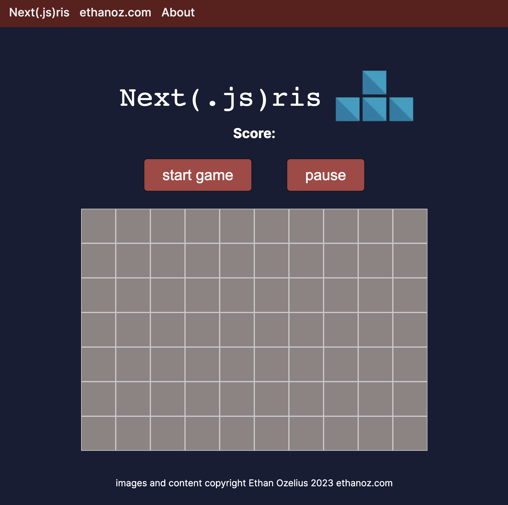

# Nextris
Fun recreation of the classic Tetris arcade game, built by Ethan Ozelius in Next.js, using TypeScript, bootstrapped with [`create-next-app`](https://github.com/vercel/next.js/tree/canary/packages/create-next-app).




## Getting Started
### Run the development server
```bash
npm run dev
```

Open [http://localhost:3000](http://localhost:3000) with your browser to see the result.

### Execute test suite
```bash
npm run test
```

### Todo: lint

### Todo: typecheck

### Todo: coverage